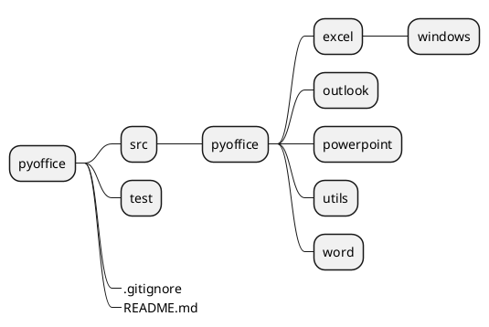
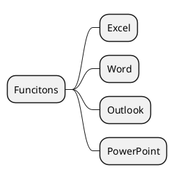

# PyOffice

## 简述

基于 PyWin32 实现对 Excel、Word 等操作。

## Project Structure

## Functions

## 引用

1. [Application object (Excel)](https://docs.microsoft.com/en-us/office/vba/api/excel.application(object))