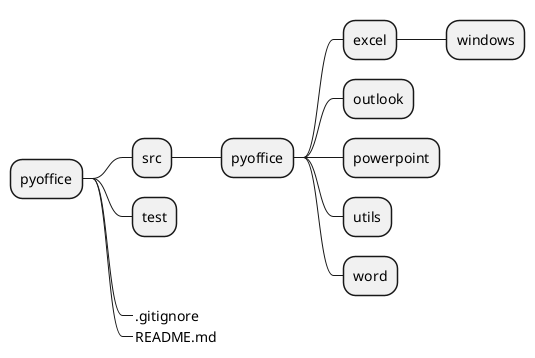
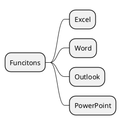

# PyOffice

## 简述

基于 PyWin32 实现对 Excel、Word 等操作。

## 项目结构

**Plantuml** 图示如下：

## 库功能

## 致谢

1. [ruofeng216](https://github.com/ruofeng216)
2. [giftbox](https://github.com/giftbox)

## 引用

1. [Application object (Excel)](https://docs.microsoft.com/en-us/office/vba/api/excel.application(object))

## 附录

### 项目结构图示

### 功能图

